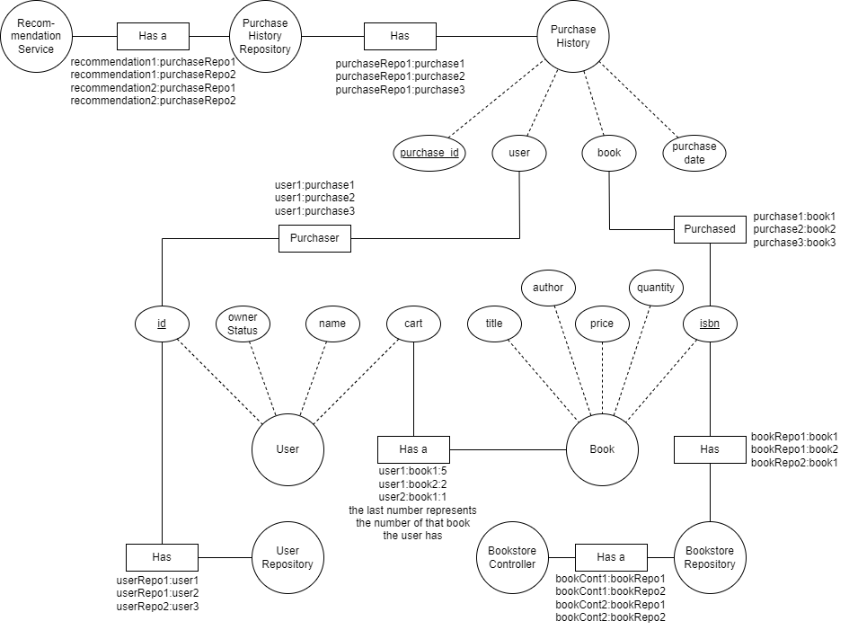
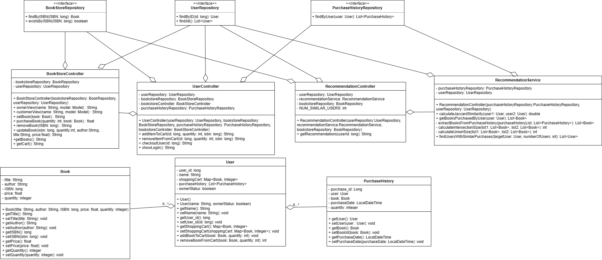

## SYSC-4806-Project
# Amazin Library

Project Status: 

Azure Link: https://sysc4810project.azurewebsites.net/
AWS CodeStar Link: http://ec2-13-59-196-47.us-east-2.compute.amazonaws.com/

Team Members:
* Farhan Mahamud - 101147861
* Subear Jama - 101154626
* Jacob Hovey - 101163798
* Ilyes Hasnaou - 101146081
* Patrick Vafaie - 101152154

## Overview
For this project, our group is creating an online book store where users can buy books that are available and are in stock 
and owners can add and remove the books from the book store. Using Java Spring Boot, AJAX, and deployment tools like
Microsoft Azure, we are able to create a web application that portrays our project idea.

## Milestone 1 (November 13, 2023):
In this milestone, we are currently building a prototype of our project. The main goals were the following:
  - Having a functioning project
  - Deploy the application using AWS
  - Have a functioning UI using HTML and AJAX

## Milestone 2 (November 27, 2023):
In this milestone, we have built an alpha release. The main goals for this milestone are the following:
  - Have a somewhat usable system
  - Be very close to being feature complete
  - Have most features be usable and correctly deployed on Azure

# Additions for Future Milestones:
  - Finalize the implementation of all remaining features
  - Finish the project

# Responsibilities for Milestone 1
  - Farhan: Repository creation, CI/CD actions, README file, ORM and UML Diagram, and Azure Deployment
  - Subear: Implement Book and BookStoreController functionalities and respective tests
  - Jacob: Implement BookstoreController functionalities and repsective tests and made HTML views
  - Patrick: Implement Bookstore functionalities and respective tests
  - Ilyes: Implement User and UserController functionalities and respective tests

# Responsibilities for Milestone 2
  - Farhan: Implemented the update function for books and frontent checkout use case + corresponding tests
  - Subear: Implemented functional login system and security config + corresponding tests and concurrency tests for multiple users
  - Jacob: Created AWS repo for this project and changed default view to user view unless user is an owner, as well as added the AJAX calls to auto refresh
  - Patrick: Implemented book recommendation feature and integrated feature fully with front end + corresponding tests
  - Ilyes: Implemented purchaseBook backend feature in both controllers and backend checkout use case + corresponding tests and concurrency tests + README file
   
# Diagrams
Object-Role-Modeling

Unified-Modeling-Language

